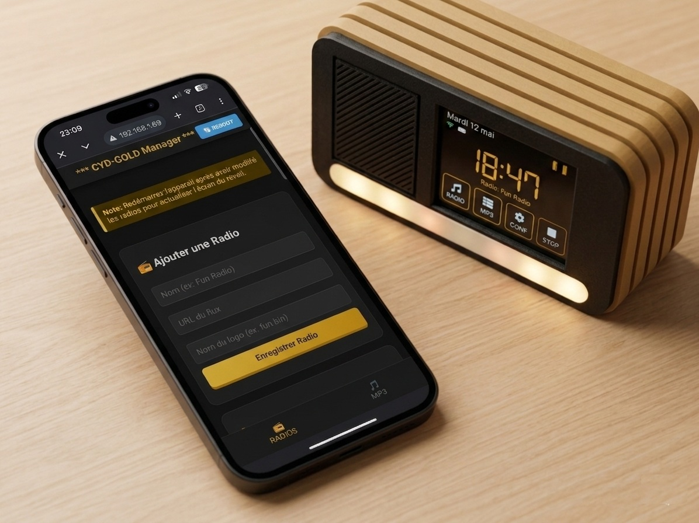
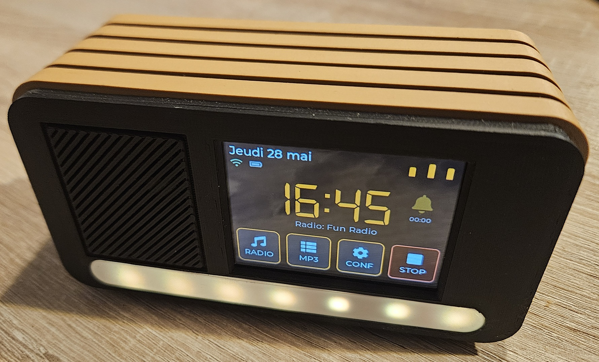
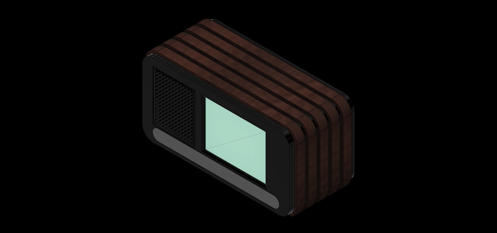

# CYD-GOLD

> Internet Radio / MP3 Player / Connected Alarm Clock on ESP32-S3



[](https://www.arduino.cc/)
[](https://github.com/espressif/arduino-esp32)
[](https://lvgl.io/)
[](LICENSE)

---

## Overview

CYD-GOLD is a fully custom internet radio, MP3 player and alarm clock built around an **ESP32-S3** with a **320x240 capacitive touchscreen** and a retro-vintage 3D-printed wooden enclosure.

Everything — firmware, UI, enclosure — was designed from scratch.



---

## Features

### Radio & Audio
- Web radio streaming (MP3/AAC) over WiFi
- Scrollable station list with custom logos (RGB565 binary format)
- Scrolling ICY metadata title in real time
- 3-band equalizer (Bass / Mid / Treble, -10 to +6 dB)
- Volume control

### MP3 Player
- Plays MP3 files from SD card (`/mp3` folder)
- Scrollable track list, auto-advance, shuffle mode
- Progress bar updated every 500ms

### Alarm Clock
- 3 alarm modes: Radio / MP3 / Buzzer (fallback stored in Flash)
- DS3231 RTC for accurate timekeeping independent of WiFi
- NTP sync at boot and every 24h
- 33 world timezones (POSIX strings, grouped by region)
- Alarm badge on home screen with time display

### Interface
- **LVGL 8** — smooth UI with PSRAM-allocated display buffer (40 rows)
- **6 visual themes**: Orange/Black, Cyberpunk Blue, Matrix Green, Blue Pastel, Dusty Rose, Sage Green
- **6 languages**: French, English, Spanish, Italian, German, Portuguese
- 5-bar audio visualizer on home screen
- WiFi and battery status icons updated in real time

### LED Strip
- WS2812B strip (7 LEDs) with 4 animation modes: Fixed / Rainbow / Wave / Pulse
- Full color wheel picker with live preview
- Brightness slider

### Connectivity
- Auto-reconnect on WiFi loss (tries all saved networks)
- **Password-protected web manager** (HTTP Basic Auth) for:
  - Adding / removing radio stations
  - Uploading MP3 files and custom logos to SD
  - Remote reboot
- Up to 5 saved WiFi networks

### Power
- Deep sleep via slide switch on GPIO 2 (~10µA draw)
- Clean shutdown (saves config, stops audio, turns off LEDs/screen)
- Wake-up on EXT1 (switch flipped back to ON)

---

## Hardware

| Component | Details | Reference |
|---|---|---|
| Main board | ESP32-S3 with 2.8" 320x240 capacitive touchscreen, ES3C28P dual-core 240MHz, WiFi + BT, ES8311 codec onboard | ESP32-S3 CYD (XiaoZhi AI compatible) |
| LED strip | WS2812B x7 addressable RGB LEDs | WS2812B strip |
| Heat inserts | M2.5 brass threaded heat inserts (for 3D printed parts assembly) | M2.5 heat inserts |
| Screws | M2.5 screws (various lengths) | M2.5 screws |
| RTC | DS3231 real-time clock module | DS3231 |
| Speaker | 3W 4Ω round speaker 50mm / 1.97" | Sourcing Map 3W 4Ohm |
| USB-C panel connector | Panel-mount USB-C female with waterproof cap, 4-wire pigtail, OTG adapter | CESFONJER chassis USB-C |
| SD card extension | Micro SD/TF card slot with 10cm FPC flat flexible extension cable (male to female) | ChenYang TF FPC kit |
| Internal USB-C cable | Short 90° angled USB-C to USB-C flat cable, USB 2.0, 65W, 7.5cm, black | Xiwai right-angle USB-C 7.5cm |
| Battery | 3.7V 2000mAh 103454 LiPo rechargeable with JST connector | EEMB 103454 |
| Sleep switch | Micro slide switch 3-pin 2-position SS12F44 (3mm) | SS12F44 |
| Connectors | JST 1.25mm 2-pin and 4-pin wire pairs | JST 1.25mm kit |
| SD card | Micro SD card 16GB or 32GB (Class 10 recommended) | — |

> The ESP32-S3 CYD board already integrates the **ILI9341 display**, **FT6336 capacitive touch controller**, **ES8311 audio codec** and **amplifier** — no separate modules needed for these.

Pin assignments are in [`config.h`](config.h).

---

## 3D Enclosure

Designed in **Fusion 360**, inspired by 1970s vintage radios.



| File | Description |
|---|---|
| `Corps.stl` | Main body |
| `Face.stl` | Front panel with screen cutout and CYD board mount |
| `Dos.stl` | Back panel — DS3231 mount, slide switch and USB-C port |
| `Cercle.stl` | Speaker retaining ring |
| `LED.stl` | LED diffuser (bottom ambient light) |
| `Lamelles_x5.stl` | Decorative side slats (vintage look) |
| `Pieds_x4.stl` | Feet |

**Print settings:**
- Material: PLA (body) + Wood PLA (slats) for the natural look
- Layer height: 0.2mm
- Infill: 20% (body) / 35% (slats and feet) / 45% gyroid (back panel)
- Supports: required for front panel and body

---

## Software

### Dependencies

| Library | Version | Purpose |
|---|---|---|
| [ESP32-audioI2S](https://github.com/schreibfaul1/ESP32-audioI2S) | **3.4.6** | Audio streaming and MP3 playback |
| [LVGL](https://lvgl.io/) | **8.3.11** | Touch UI framework |
| [FastLED](https://github.com/FastLED/FastLED) | **3.10.3** | WS2812B LED control |
| [RTClib](https://github.com/adafruit/RTClib) | **2.1.4** | DS3231 RTC |
| [ArduinoJson](https://arduinojson.org/) | **7.4.3** | Station list (radios.json) |
| [TFT_eSPI](https://github.com/Bodmer/TFT_eSPI) | **2.5.43** | TFT display driver |
| FT6336 | included | Capacitive touch driver (bundled in repo) |
| WebServer | built-in | Web manager |

> **FT6336** : no official release — the driver source (`FT6336.h` / `FT6336.cpp`) is included directly in the project repository. No separate installation needed.

> **ESP32 Arduino Core** : tested on version **3.3.8**. Install via Arduino IDE Boards Manager → search `esp32` by Espressif.

### Arduino IDE Board Settings

| Setting | Value |
|---|---|
| Board | ESP32S3 Dev Module |
| Flash Size | **16MB (128Mb)** |
| Partition Scheme | **16M Flash (3MB APP/9.9MB FATFS)** |
| PSRAM | **OPI PSRAM** |
| CPU Frequency | 240MHz (WiFi) |
| Upload Speed | 115200 |

> On first flash, set **Erase All Flash Before Sketch Upload → Enabled**, then disable it.

---

## Getting Started

### Option A — Flash the pre-compiled binary (easiest)

No Arduino IDE required. Use **ESP Web Flasher** directly in your browser (Chrome / Edge only).

1. Download the latest release from the [Releases](../releases) page
2. Extract the zip — it contains 4 files:

| File | Flash address |
|---|---|
| `bootloader.bin` | `0x0000` |
| `partitions.bin` | `0x8000` |
| `boot_app0.bin` | `0xe000` |
| `esp32s3audio.bin` | `0x10000` |

3. Open [https://espressif.github.io/esptool-js/](https://espressif.github.io/esptool-js/) in Chrome or Edge
4. Connect your ESP32-S3 via USB, click **Connect**, select your COM port
5. Add each file with its address and click **Program**

> On first boot, hold **BOOT** button while plugging USB if the board does not enter flash mode automatically.

---

### Option B — Build from source

### 1. Clone the repository

```bash
git clone https://github.com/cyrilrudler-create/Reveil-CYDGOLD.git
cd Reveil-CYDGOLD
```

### 2. Install libraries

Install all dependencies listed above via Arduino IDE Library Manager or PlatformIO.

### 3. Configure pins

Edit [`config.h`](config.h) if your hardware differs.
By default it targets the CYD-GOLD board (see schematic).

### 4. Flash

Open `esp32s3audio.ino` in Arduino IDE, select your board settings and upload.

The firmware will:
- Format LittleFS on first boot and restart
- Initialize the SD card structure (`/mp3`, `/logos`, `/radios.json`, `/buzzer.mp3`)
- Connect to WiFi if credentials are saved
- Display the home screen

### 5. Add your first radio station

Open a browser and navigate to `http://<device_ip>/` (login: `admin` / `cydgold`).

> **Change the default password** in `web_server.cpp` before flashing:
> ```cpp
> #define WEB_USER     "admin"
> #define WEB_PASSWORD "your_password"
> ```

---

## SD Card Structure

```
/
├── radios.json         Station list (auto-created with FIP fallback)
├── buzzer.mp3          Alarm buzzer (auto-restored from Flash)
├── mp3/                MP3 files for the player
└── logos/
    ├── def.bin         Default station logo (auto-restored)
    └── *.bin           Custom station logos (RGB565A8, 100x100px)
```

### Adding custom logos

1. Prepare a 100x100px PNG
2. Convert at [LVGL Image Converter v8](https://lvgl.io/tools/imageconverter)  
   → Color format: `CF_RGB565A8` → Output: Binary
3. Upload the `.bin` via the web manager

---

## Configuration

All settings are saved automatically to LittleFS `/config.bin`:

- WiFi credentials (up to 5 networks)
- Alarm time, mode, station
- Volume, equalizer
- LED color and brightness
- Selected theme and language
- Timezone (POSIX string)

---

## Architecture

```
esp32s3audio.ino    Main sketch (setup, loop, callbacks, config)
config.h            All GPIO pin definitions
structures.h        Config, Station, RadioTheme structs
themes.cpp          6 LVGL color palettes
fonctions.cpp       Station loader, battery ADC
display_gui.h       TFT init, SD init, LVGL FS driver
codec_es8311.h      ES8311 audio codec driver (I2C/ESP-IDF)
led_control.cpp     WS2812B animations (FastLED)
web_server.cpp      HTTP web manager
ui_home.cpp         Home screen
ui_radio.cpp        Web radio screen
ui_mp3.cpp          MP3 player screen
ui_alarme.cpp       Alarm settings + check_alarme()
ui_config.cpp       Settings menu
ui_wifi.cpp         WiFi manager (scan, connect, save)
ui_equalizer.cpp    3-band EQ
ui_leds.cpp         LED settings
ui_themes.cpp       Theme picker
ui_pays.cpp         Timezone picker
ui_traduction.cpp   Language picker
ui_info.cpp         System info
ui_lang.cpp         Translation tables (FR/EN/ES/IT/DE/PT)
```

---

## License

The **source code** is released under the [MIT License](LICENSE).

The **3D files** (STL) are sold separately on [Cults3D](https://cults3d.com/fr/mod%C3%A8le-3d/maison/radio-reveil-cyd-gold-boitier-imprime-3d).

---

## Author

Made with passion by **CyrilTech** — 2026

*If you build one, share a photo!*

